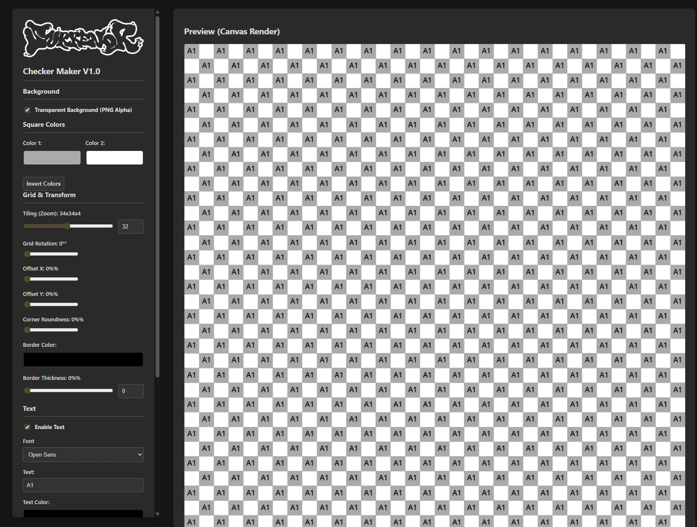

# Surr – Checker Maker

> Un mini-outil web pour générer des damiers (checker patterns) personnalisés, exportables en PNG haute résolution.

Fait partie de la collection **Surr Mini Tools** par [Surrendr Studio](https://www.surrendr.art).

---

## Démo en ligne

[**→ Tester le Checker Maker**](https://surrendrart-hub.github.io/Surr-MiniTool-checker-maker/)


---

## Aperçu



---

## Fonctionnalités

- **Fond transparent (PNG alpha)** ou couleur unie au choix
- **Deux couleurs de carrés** personnalisables + bouton « Invert Colors »
- **Tiling (zoom)** de 2×2 jusqu'à 64×64
- **Rotation de la grille** de 0° à 90°
- **Décalages X / Y** pour repositionner le motif
- **Coins arrondis** sur les carrés (0–100 %)
- **Bordures** : couleur et épaisseur réglables
- **Texte intégré** dans les carrés : police, couleur, taille, offset X/Y
- **Watermark / logo** uploadable avec zoom indépendant
- **Export PNG** en 512, 1024, 2048 ou 4096 px

---

## Utilisation

1. Ouvre la [démo en ligne](https://surrendrart-hub.github.io/Surr-MiniTool-checker-maker/) (ou `index.html` en local).
2. Règle les paramètres dans le panneau de gauche — l'aperçu se met à jour en direct sur le canvas de droite.
3. Choisis la résolution de sortie.
4. Clique sur **Download PNG**.

---

## Lancer en local

Aucune installation requise — c'est du HTML / CSS / JS pur.

```bash
git clone https://github.com/surrendrart-hub/Surr-MiniTool-checker-maker.git
cd Surr-MiniTool-checker-maker
# Ouvre index.html dans ton navigateur,
# ou sers le dossier avec un petit serveur local :
python -m http.server 8000
# puis ouvre http://localhost:8000
```

---

## Structure du projet

```
.
├── index.html          # Interface principale
├── css/
│   └── style.css       # Mise en page et thème
├── java/
│   └── script.js       # Logique du canvas et export PNG
├── fonts/              # Open Sans (regular, 600, 700, 800)
├── images/
│   └── avatar_surrendr.png
└── .htaccess
```

---

## Déploiement (GitHub Pages)

Pour publier la démo en ligne :

1. Va dans **Settings → Pages** sur le dépôt GitHub.
2. Sous **Source**, choisis la branche `main` et le dossier `/ (root)`.
3. Clique sur **Save**.
4. Au bout de quelques secondes, le site est disponible sur :
   **https://surrendrart-hub.github.io/Surr-MiniTool-checker-maker/**

---

## Technologies

- HTML5 Canvas API
- JavaScript vanilla (pas de framework)
- CSS3
- Open Sans (Google Fonts, hébergé en local)

---

## Auteur

Fait avec soin par **[Surrendr Studio](https://www.surrendr.art)**.

## Licence

Tous droits réservés © Surrendr Studio — sauf mention contraire.
